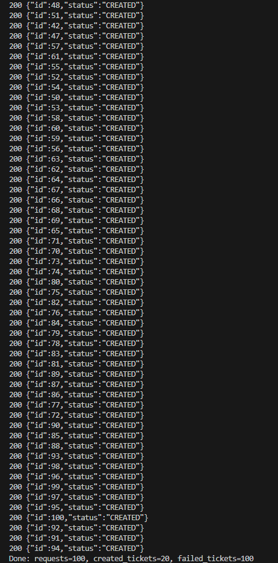

## CLIENTE CONCCURRENTE JAVA

Este cliente se encarga de hacer peticiones concurrentes al API del servicio de turnos

```java

public class ConcurrentClient {
    private static final String URL = "http://localhost:8080/api/turn/ticket";

    public static void main(String[] args) throws Exception {
        int requests = 100;
        int concurrency = 20;

        HttpClient client = HttpClient.newBuilder()
                .connectTimeout(Duration.ofSeconds(10))
                .build();

        HttpRequest request = HttpRequest.newBuilder()
                .GET()
                .uri(URI.create(URL))
                .timeout(Duration.ofSeconds(10))
                .build();

        ExecutorService pool = Executors.newFixedThreadPool(concurrency);
        AtomicInteger success = new AtomicInteger(0);
        AtomicInteger failed = new AtomicInteger(0);
        CountDownLatch latch = new CountDownLatch(requests);

        for (int i = 0; i < requests; i++) {
            pool.submit(() -> {
                try {
                    HttpResponse<String> resp = client.send(request, HttpResponse.BodyHandlers.ofString());
                    success.incrementAndGet();
                    System.out.println(resp.statusCode() + " " + (resp.body() == null ? "" : resp.body()));
                } catch (Exception e) {
                    failed.incrementAndGet();
                    System.out.println("ERROR: " + e.toString());
                } finally {
                    latch.countDown();
                }
            });
        }
    
        latch.await();
        pool.shutdownNow();

        System.out.printf("Done: requests=%d, created_tickets=%d, failed_tickets=%d",
                requests, concurrency, success.get(), failed.get());
    }
}
```
- Hace las llamadas al servidor(debe estar corriendo previmente)
- Crea un pool de hilos 20 para hacer llamados al api de forma concurrente
- Se hacen 100 peticiones al api para crear nuevos tickets
- Se muestra un reporte de las peticiones hechas

## Ejecucion:

